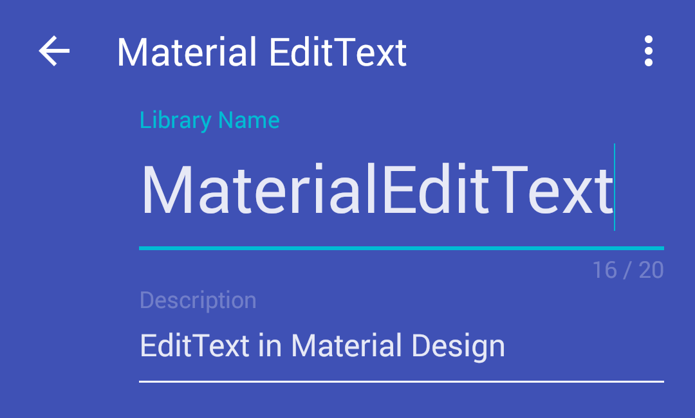

MaterialEditText
================



AppCompat v21 makes it easy to use Material Design EditText in our apps, but it's so limited. If you've tried that, you know what I mean. So I wrote MaterialEditText, the EditText in Material Design, with more features that [Google Material Design Spec](http://www.google.com/design/spec/components/text-fields.html) has introduced.

## Features and Usages
1. Basic.

  Just use `com.rengwuxian.materialedittext.MaterialEditText` instead of `EditText` in your layout xml. `MaterialEditText` has directly inherited `EditText`, so you don't have to change your java code.
  ```java
  <com.rengwuxian.materialedittext.MaterialEditText
    android:layout_width="match_parent"
    android:layout_height="wrap_content"
    android:hint="Basic"/>
  ```
  
  
2. Custom Base Color

  Base color will be used as bottom line color, text color (reset alpha to 87%) and hint text color (reset alpha to 26%). You can use `app:baseColor` in xml or `setBaseColor()` in java code. If you haven't set a base color, black will be used.
  
  ```java
  app:baseColor="#0056d3"
  ```
  
  
  
3. Custom Primary Color

  Primary color will be used as the activated bottom line color, highlight floating label color, and singleline ellipsis color. You can use `app:primaryColor` in xml or `setPrimaryColor()` in java code. If you haven't set a primary color, the base color will be used.
  
  ```java
  app:baseColor="#0056d3"
  app:primaryColor="#982360"
  ```
  
  
  
4. Floating Label

  There're 3 modes of floating label: `none`, `normal`, and `highlight`. You can use `app:floatingLabel` in xml or `setFloatingLabel()` in java code.
  
  normal:
  
  ```java
  app:floatingLabel="normal"
  ```
  
  
  
  highlight:
  
  ```java
  app:floatingLabel="highlight"
  ```
  
  
  
5. Single Line Ellipsis

  Use `app:singleLineEllipsis=true` int xml or `setSingleLineEllipsis()` in java code to enable the ellipsis for when some texts scroll left. Touching the ellipsis jumps the cursor back to the beginning of the string. 
  
  _NOTE: Single Line Ellipsis may increase the View's height to the bottom._
  
  ```java
  app:singleLineEllipsis="true"
  ```
  
  
  
6. Max Characters

  Use `app:maxCharacters` in xml or `setMaxCharacters()` in java code to set the max characters count. The bottom line will turn red when exceeding max characters. 0, as default, means no max characters. You can also customize the error color using `app:errorColor` or `setErrorColor` in java code.
  
  NOTE: Max Characters may increase the View's height to the bottom.
  
  default error color:
  
  ```java
  app:maxCharacters="10"
  ```
  
  
  
  custom error color:
  
  ```java
  app:maxCharacters="10"
  app:errorColor="#ddaa00"
  ```
  
  
  
## Download

gradle:

```groovy
compile 'com.rengwuxian.materialedittext:library:0.1'
```
